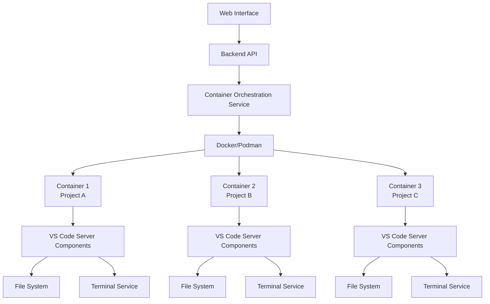
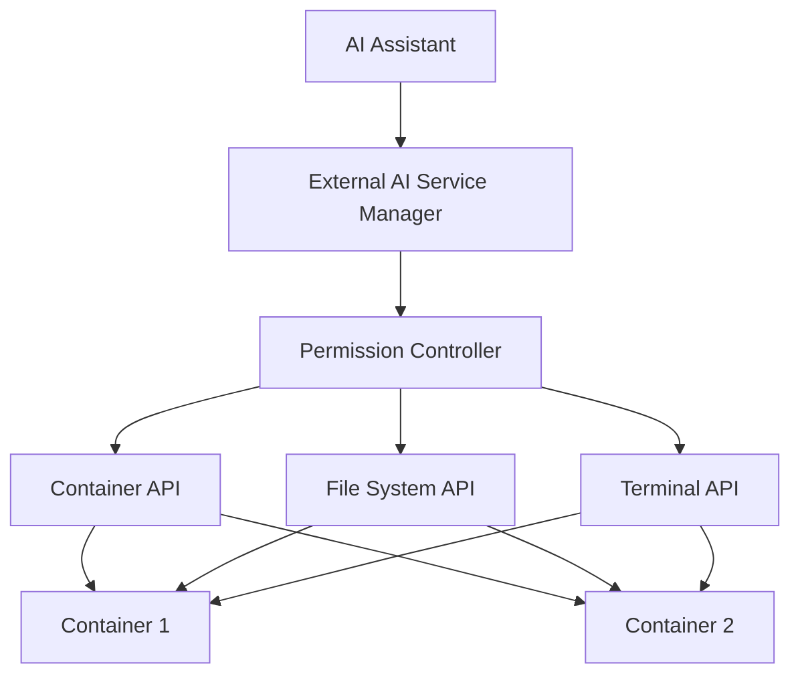

# AiCockpit: Containerized AI-Collaborative Development Platform

## **The Complete AI-Collaborative Development Solution**

**Where containerized workspaces meet external AI services for seamless development**

Welcome to AiCockpit! This platform provides containerized development environments with seamless integration with external AI services. Our mission is to transform how developers work with AI by providing reliable, easy-to-use tools that enhance productivity without the complexity of self-hosted models.

**Our Philosophy:** *"If you don't care about your tools, then you don't care about the result. Making good tools are the best tools - take pride and time to maintain them as they do the same for you."* This project embodies a partnership between human creativity and AI-driven precision, providing developers with powerful tools for modern software development.

---

## 🚀 **Current Status & Product Features**

### **Version**: 1.0.0-beta
**Health Score**: 95.7/100 - HEALTHY
**Status**: **READY FOR USE**

### **✅ Core Features**
- [x] **Containerized Development Environments**: Instant, isolated workspaces with pre-configured development stacks
- [x] **Web-Based IDE**: Complete IDE interface with file browser, code editor, and terminal
- [x] **Workspace Management**: Dashboard UI for creating, managing, and launching workspaces
- [x] **External AI Services**: Integration with LM Studio, OpenAI, Azure OpenAI, and custom services
- [x] **AI-Assisted Development**: Context-aware code suggestions and terminal command assistance
- [x] **Collaborative Features**: Workspace sharing and team collaboration tools

### **📦 Supported Development Stacks**
- **Anaconda Python**: Pre-configured Python environment with popular data science libraries
- **Node.js 18**: JavaScript/Node.js development environment
- **Python 3.11**: Clean Python 3.11 installation
- **Go 1.21**: Go programming language environment
- **Java 17**: Java development environment

### **🤖 External AI Service Integration**
- **LM Studio**: Run local AI models on your machine
- **OpenAI**: Access to GPT models
- **Azure OpenAI**: Enterprise-grade AI services
- **Custom Services**: Connect to any OpenAI-compatible API

---

## 🚀 Getting Started

Getting started with AiCockpit's containerized development platform:

### **Quick Setup**

```bash
# Clone the repository
git clone https://github.com/MadGoatHaz/AiCockpit.git
cd AiCockpit

# Set up Python environment (recommended)
python -m venv aicockpit-env
source aicockpit-env/bin/activate  # On Windows: aicockpit-env\Scripts\activate
pip install -r requirements.txt

# Set up external AI services
python scripts/setup_external_ai.py

# Start the backend (FastAPI)
cd acp_backend
uvicorn main:app --host 0.0.0.0 --port 8000

# In a new terminal, start the frontend (Next.js)
cd acp_frontend
npm install
npm run dev
```

### **Using Containerized Workspaces**

1. Ensure Docker is installed and running on your system
2. Start the backend and frontend as described above
3. Navigate to the "Workspaces" section in the web interface
4. Create a new workspace with your preferred development environment
5. Launch the IDE for your workspace

See the [Workspace User Guide](docs/WORKSPACE_USER_GUIDE.md) for detailed instructions.

### **Configuring External AI Services**

1. Run the setup script:
   ```bash
   python scripts/setup_external_ai.py
   ```

2. Follow the interactive prompts to configure your services

3. Start the backend and frontend as described in the Quick Start Guide

4. In the web interface, go to "AI Config" panel to manage your services

---

## 🏗️ Platform Architecture

### **System Components**
- `acp_backend/`: FastAPI backend with containerized workspace management
- `acp_frontend/`: Next.js frontend with workspace dashboard and IDE interface
- `docs/`: Comprehensive documentation and guides
- `scripts/`: Development tools and setup utilities
- `infrastructure/`: Docker configurations and deployment files

### **Containerized Workspace Architecture**



### **AI Integration Architecture**



---

## 📚 Documentation

### **User Guides**
- **[Workspace User Guide](docs/WORKSPACE_USER_GUIDE.md):** How to use containerized workspaces
- **[Product Focus](docs/PRODUCT_FOCUS.md):** Our approach to creating a complete product
- **[Development Status](docs/NEW_DEVELOPMENT_STATUS.md):** Current implementation status and future plans

### **Technical Documentation**
- **[New Technical Architecture](docs/NEW_TECHNICAL_ARCHITECTURE.md):** Deep technical specifications
- **[Containerized IDE Architecture](docs/NEW_CONTAINERIZED_IDE_ARCHITECTURE.md):** Containerized development environment design
- **[New Project Restructure Plan](docs/NEW_PROJECT_RESTRUCTURE_PLAN.md):** Detailed transformation roadmap

---

## 🤝 Community & Collaboration

This project embodies a partnership between human insight and AI capability. We're building tools that developers can rely on for their daily work.

### **Our Commitment**
- **Quality Over Quantity** - Every feature meticulously crafted
- **Community First** - Building for and with the developer community
- **Long-term Vision** - Architecture designed for years of growth
- **Open Source Excellence** - Transparent development and comprehensive documentation

### **Join Our Community**
We invite you to be part of this transformation. Whether you're a developer, designer, or visionary, there's a place for you in building the future of AI-collaborative development.

**Thank you for using AiCockpit. Let's make development more beautiful, powerful, and accessible to all.**

---

*"The best tools don't just solve problems - they inspire new possibilities. AiCockpit is our gift to the future of software development."*
