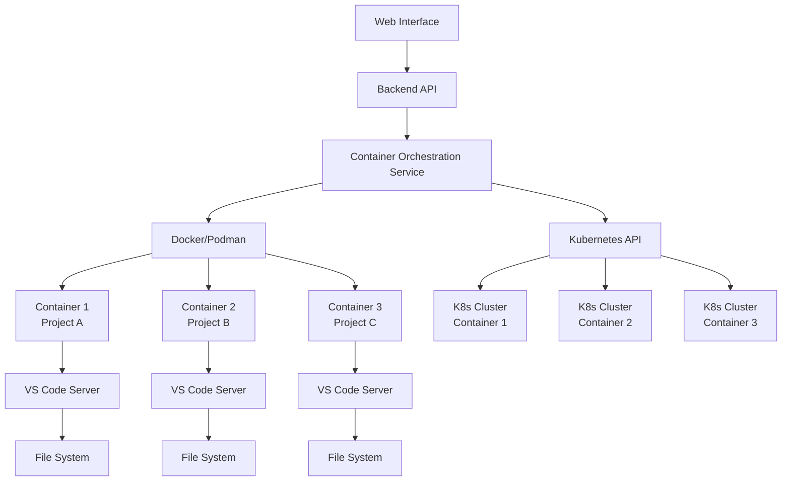
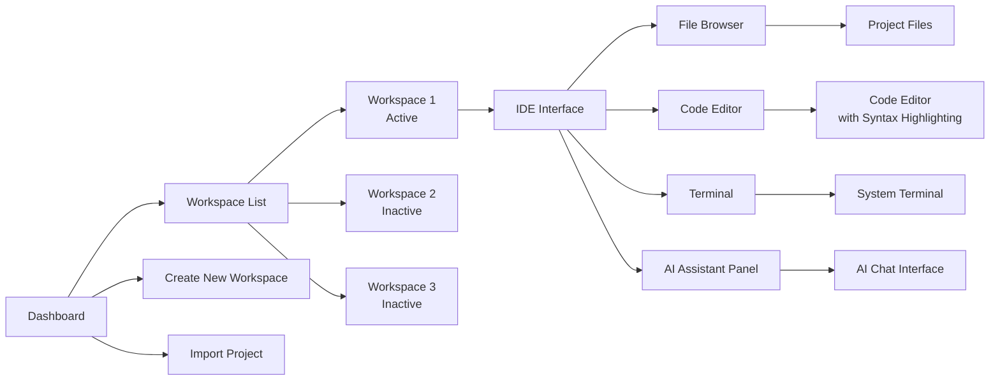
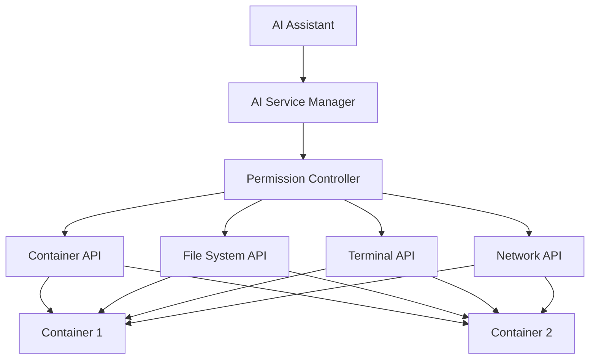

# AiCockpit Containerized Web-Based IDE Architecture

## Overview

This document outlines the architectural plan for transforming AiCockpit into a containerized web-based IDE similar to GitHub Codespaces, where users can switch between containerized development environments. The platform will provide VS Code level system access for both users and AI, enabling seamless collaboration within individualized containerized workspaces.

## Containerized Development Environment Architecture

### Container Orchestration

### Container Environment Components

1. **Base Container Image**
   - Ubuntu/Debian base with development tools
   - Git, curl, wget, build-essential
   - Language runtimes (Python, Node.js, Go, etc.)
   - Package managers (npm, pip, cargo, etc.)

2. **VS Code Server**
   - OpenVSCode Server for web-based IDE experience
   - Extensions pre-installed for common development tasks
   - Custom AiCockpit extensions for AI integration

3. **File System**
   - Project files mounted as volumes
   - Persistent storage for user data
   - Shared volumes for collaboration

4. **Network Configuration**
   - Isolated network per container
   - Port mapping for services
   - Secure communication channels

## Web-Based IDE Interface Design

### Workspace Management

### Interface Components

1. **Workspace Dashboard**
   - List of all user workspaces
   - Quick actions (create, import, delete)
   - Workspace status indicators
   - Resource usage metrics

2. **IDE Interface**
   - Tabbed interface for multiple files
   - File browser with project structure
   - Code editor with syntax highlighting
   - Integrated terminal
   - AI assistant panel

3. **Workspace Switching**
   - Quick switcher for active workspaces
   - Workspace thumbnails/previews
   - Recent workspaces list
   - Keyboard shortcuts for switching

## AI Integration for Direct System Access

### AI System Access Architecture

### AI Capabilities

1. **File System Access**
   - Read/write files within workspace
   - Create/delete directories
   - File search and navigation
   - Code refactoring operations

2. **Terminal Commands**
   - Execute shell commands
   - Run build scripts
   - Manage dependencies
   - Debug applications

3. **Code Analysis**
   - Syntax checking
   - Code completion
   - Bug detection
   - Performance optimization suggestions

4. **Project Management**
   - Version control operations
   - Dependency management
   - Build and deployment
   - Testing automation

### Security and Permissions

1. **Sandboxing**
   - Container isolation
   - Resource limits
   - Network restrictions
   - File system permissions

2. **AI Access Control**
   - Permission-based access
   - Audit logging
   - User confirmation for critical actions
   - Rate limiting

## Implementation Roadmap

### Phase 1: Core Infrastructure (Months 1-2)

1. **Container Orchestration Layer**
   - Implement Docker/Podman integration
   - Create container lifecycle management
   - Develop workspace provisioning system
   - Implement persistent storage solution

2. **Backend API**
   - Extend existing FastAPI backend
   - Add workspace management endpoints
   - Implement container control APIs
   - Create authentication and authorization

3. **Web Interface**
   - Design workspace dashboard
   - Implement workspace creation/import
   - Create basic IDE interface
   - Add workspace switching functionality

### Phase 2: IDE Features (Months 3-4)

1. **VS Code Integration**
   - Integrate OpenVSCode Server
   - Configure extensions and themes
   - Implement file browser
   - Add code editor with syntax highlighting

2. **Terminal Integration**
   - Implement web-based terminal
   - Add PTY support
   - Create terminal multiplexing
   - Implement command history

3. **Collaboration Features**
   - Real-time file sharing
   - Multi-user workspace access
   - Chat and communication
   - Conflict resolution

### Phase 3: AI Integration (Months 5-6)

1. **AI Service Integration**
   - Extend ExternalAIServiceManager
   - Implement AI command execution
   - Create file system access APIs
   - Add terminal command APIs

2. **AI Assistant Panel**
   - Design AI chat interface
   - Implement context awareness
   - Add code suggestion features
   - Create project analysis tools

3. **Advanced AI Features**
   - Code refactoring assistance
   - Automated testing
   - Debugging support
   - Performance optimization

### Phase 4: Advanced Features (Months 7-8)

1. **Kubernetes Support**
   - Add Kubernetes orchestration
   - Implement cluster management
   - Create scaling policies
   - Add monitoring and logging

2. **Enterprise Features**
   - Role-based access control
   - Audit logging
   - Resource quotas
   - Backup and restore

3. **Performance Optimization**
   - Container caching
   - Resource optimization
   - Load balancing
   - CDN integration

## Technical Requirements

### Backend Requirements

1. **Container Orchestration**
   - Docker/Podman API integration
   - Kubernetes client libraries
   - Container image management
   - Volume and network management

2. **API Services**
   - FastAPI for REST APIs
   - WebSocket for real-time communication
   - Authentication (JWT/OAuth)
   - Rate limiting and throttling

3. **Data Storage**
   - PostgreSQL for structured data
   - Redis for caching
   - Object storage for files
   - Elasticsearch for search

### Frontend Requirements

1. **IDE Components**
   - Monaco Editor for code editing
   - Xterm.js for terminal
   - React for UI components
   - Socket.io for real-time updates

2. **UI Framework**
   - Next.js for web application
   - Tailwind CSS for styling
   - ShadCN UI components
   - Responsive design

### AI Integration Requirements

1. **AI Services**
   - OpenAI API compatibility
   - Local LLM support (vLLM)
   - Model management
   - Prompt engineering

2. **Security**
   - Permission system
   - Audit logging
   - Sandboxing
   - Rate limiting

## Security Considerations

1. **Container Security**
   - Image scanning
   - Runtime security monitoring
   - Network isolation
   - Resource limits

2. **Data Security**
   - Encryption at rest
   - Encryption in transit
   - Access controls
   - Backup and recovery

3. **AI Security**
   - Command execution controls
   - File system access restrictions
   - Audit trails
   - User confirmation for actions

## Scalability Considerations

1. **Horizontal Scaling**
   - Container orchestration
   - Load balancing
   - Database sharding
   - Caching layers

2. **Resource Management**
   - Auto-scaling policies
   - Resource quotas
   - Monitoring and alerting
   - Performance optimization

## Monitoring and Observability

1. **Metrics Collection**
   - Container resource usage
   - API performance
   - User activity
   - AI service usage

2. **Logging**
   - Structured logging
   - Log aggregation
   - Error tracking
   - Audit trails

3. **Alerting**
   - System health alerts
   - Performance degradation
   - Security incidents
   - Resource exhaustion

## Conclusion

This architectural plan transforms AiCockpit into a powerful containerized web-based IDE that provides seamless collaboration between users and AI. By leveraging containerization technology and integrating AI capabilities directly into the development environment, we create a platform that enables developers to work more efficiently and effectively.

The phased implementation approach allows for gradual development and testing while ensuring that core functionality is available early in the process. The security and scalability considerations ensure that the platform can grow to meet the needs of individual developers and enterprise users alike.